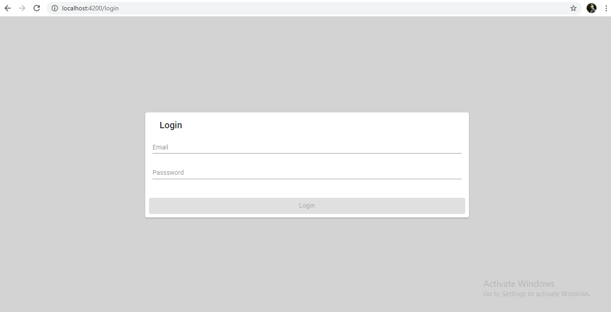
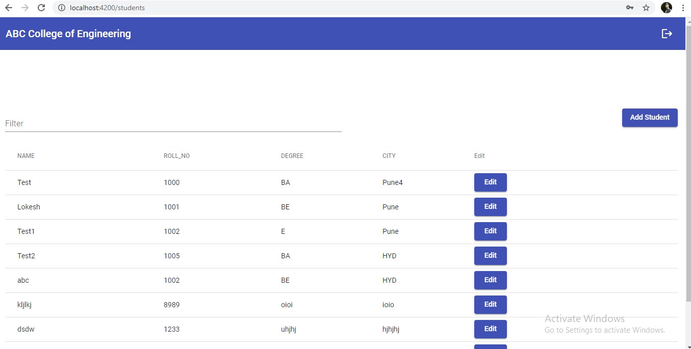

# ABC Engineering college

# Server

Server code resides in `server` folder which is based on `NodeJS` and `mongodb`

### Connection string
You can update in `server/index.js`.

### Port
Server runs on port **3000**. 

### API paths
There are two api paths.

`api/user`

`api/students`

# Fronted

Fronted is developd using Angular

It has login page and student module which is lazily loaded based on authentication.

# Run application

1. Clone this repository 
2. Run `npm install` command in root folder and in `server` folder
3. Run `npm start` in root folder to start Fronted application
4. Run `npm start` in `server` folder to start backend 

# Add Clerk

You can find `add-clerk.js` file run below command to add clerk.

  `cd server`

  `node add-clerk.js`

 Make sure you run it once. If you want to add different user then please changes the values.

 # Preview

  ## Login

  

  ## Students

  

